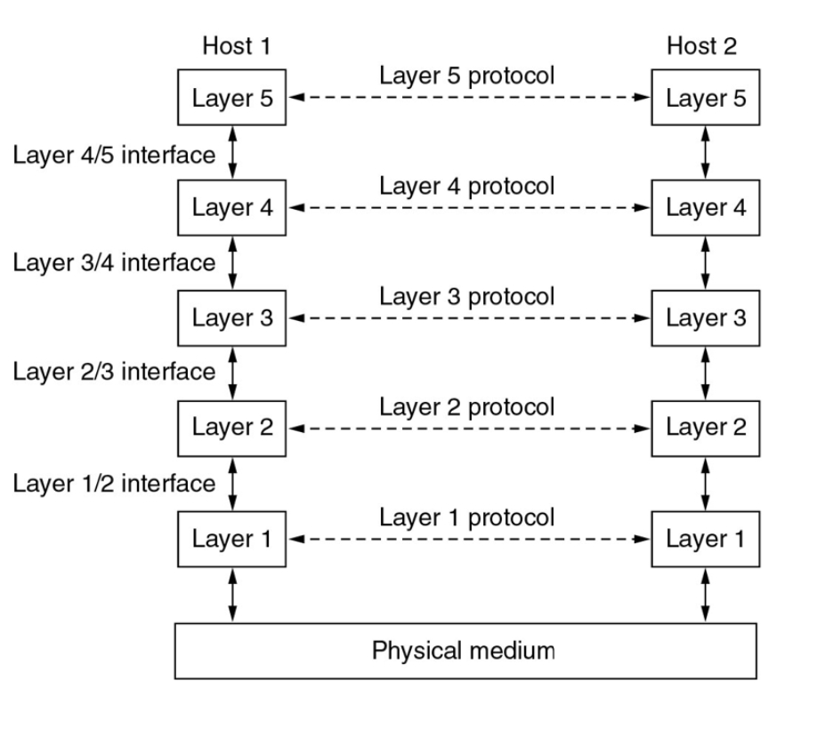

# What is a computer network

A collection of computers connected by communication links

## Links

- Can be point-to-point or broadcast
- Implemented using various transmission technologies

## Services

- The purpose of the network is to provide services to users (Humans or applications)
- Can vary widely
- Information exchange can take many forms
- Need guaranteed bandwidth (circuit-switched) or expected bandwidth (packet-switched)

## Nodes

The entities (Hosts, routers, servers, devices, programs, etc.)

## Links or Edges

The connection between entities

# Network Hardware

## Personal Area Networks

- Point-to-point (USB, SATA, etc.)
- Broadcast (Bluetooth, etc.)
 
## Local Area Networks (LAN)

- Typically private-owned, length less than 2km
- Connect PCs, Servers in offices etc. for resource sharing
- Broadcast medium is cable or radio

## Metropolitan Area Networks (MAN)

- Each house on a street linked to the junction box corresponding to the street
- Junction boxes are linked to antenna or Internet connection

## Wide Area Networks (WAN)

- Spans large geographical area 
- Consists of point-to-point (private) connections
- End systems (Hosts) are interconnected via communication sub-network called subnet
- The subnet is composed of lines(wires) and switches
- The subnet may based on packet-switched and/or circuit-switched technologies
- Router is computer providing communication services
- A subnet is a collection of routers
- Hosts send packets of data to each other via LANs and routers

## Internetworks

- Organizations want to connect their computers together into a WAN
- Telephone lines, cables and radio links are used to connect LANs and subnets together
- Connecting networks together to form a network of networks is called an **internet**
- The largest (worldwide) internet is called **the Internet**
- An **intranet** is just an internet which uses security mechanisms to restrict access to limited number of users
- An **extranet** is an intranet to which an organization's customers also have access

## The Internet

- Not the same as the World Wide Web (WWW)
	- The Internet is an infrastructure that allows different application programs to interact to provide services to users
	- The WWW is just another service that uses the Internet

### When you access a page on the web:

1. Your computer contacts the local router through the LAN
1. Your computer obtains the numerical address of the remote server where the web page resides.
1. Your computer establish a connection with the remote server
1. Information is transferred and from the server over a large number of links, routers and networks

# Network Software

## Communication Protocols

- Consist of a set of rules governing the interaction of processes in a network
- It defines:
	- The service it provides
	- The assumptions about the environment where it executes, including services it uses
	- The type and format of the message (called packets or frames) used to implement it
	- The rules (algorithms) guarding the consistency of message exchanges and the integrity of the service provided

## Connection-Oriented service protocol

- It works in a similar way to the telephone system:
	1. Establish a connection
	1. Use established for data transfer
	1. Release the connection
- Optionally, a reliable service with acknowledgement can be provided: data is always delivered and in the order sent

## Connectionless service protocol

- Similar to the way that postal system works
- No attempt to set up a connection
- Each message carries the full destination address
- Each message is routed through the network independent of all the others
- Often called a datagram service
- Acknowledged datagram service is like registered post

## Protocol/service hierarchies

- Networks are organized as a series of layers, each one built on the one below it
- Each layer offers services to the upper layers, shielding them from the details how the services are actually implemented
- Layer *N* on one machine holds a conversation with layer *N* on another machine (called a peer). Data is sent indirectly between peers, by using the services of the lower layers

	
## The OSI Reference Model

- Open System Interconnection

- Divided communication into 7 smaller and more manageable problems, by creating layers
- Lower 3 layers deal with physical network
- Upper 4 layers deal with application
- Active elements in each layer are called entities
- Entities in the same layer on different machines are called peer entities. The exchange Protocol Data Units (PDU)

### Layer 1 - Physical layer
- Defines the electrical, mechanical, procedural, and functional specifications for:
	- Activating the physical link between end systems
	- Maintaining the physical link between end systems
	- Deactivating the physical link between end systems
- It deal with:
	- Voltage levels
	- Timing of voltage signals
	- Physical data rates
	- Maximum transmission distances
	- Physical connectors

### Layer 2 - Data link layer
- Provides data transmission service free of transmission errors between adjacent nodes using the physical layer
- Break data from network layer into frames, transmits these sequentially to the other side and re-assembles.
	- Process acknowledgements
	- Detect and recover from damaged, lost and duplicate frame problems
	- Make sure the transmitter does not drown the receiver
	- Control the access to the medium in broadcast networks

### Layer 3 - Network layer
- Controls how a packet is routed from source to destination through a subnet. It must:
	- Determine the route for each source/destination pair
	- Perform congestion control (when there are too many messages in transit)
	- Overcome the problem of interconnecting heterogeneous subnet
	
### Layer 4 - Transport layer
- Is the lowest end-to-end layer between source and destination applications
- It creates a distinct network connection for each transport connection
	- Or creates multiple connections and divides the  data among those connections to improve performance
	- Or share several transport connections onto the same network connection to reduce cost
- It provides end to end flow control (Data link only deal with adjacent nodes)
- It provides end to end detection and correction
- It may provide additional congestion control

### Layer 5 - Session layer
- Token management
	- Who has access to shared resource?
- Data synchronization
	- Where were we before the line went down?
	
### Layer 6 - Presentation layer
- Concerned with syntax and semantics of data rather than it's transmission
- Provides common data abstractions to allow communication between heterogeneous computers

### Layer 7 - Application layer
- Where the applications reside:
	- TELNET
	- FTP
	- SMTP
	- NNTP
	- HTTP
	- DNS
	
